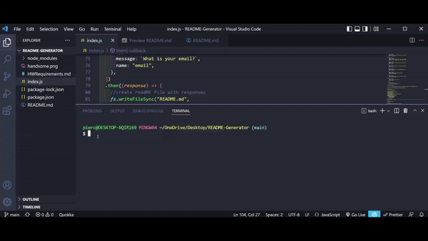
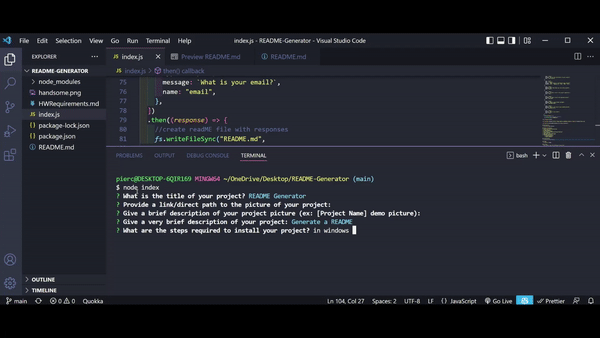
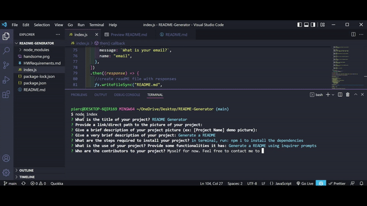

# README Generator

## Description
- Easily create a structured README

## Table Of Contents
* [Installation](#installation)
* [Usage](#usage)
* [License](#license)
* [Contribution Guidelines](#contribution)
* [Tests](#tests)
* [Deployed Link](#deployed)
* [Contact](#contact)
    * [Github](#github)
    * [Email](#email)

## Installation
- Have nodeJS and Inquirer installed

## Usage
- Generates a README file for your projects using Inquirer

## License
- This project uses the following license: 
     ***MIT***

## Contributors
- Myself for now. To contribute, please request a pull request or contact me below.

## Tests
- Self-tested using VSCode Terminal/node

## README Generator Github Repository: 
- [README Generator](https://github.com/axe714/PasswordGenerator)

## Deployed Link:
- [README Generator](https://github.com/axe714/PasswordGenerator)

## Contact Information:
- [Github Profile - Axe714](https://github.com/axe714)

### Email:
- For inquiries/questions, please reach out to me at allec@github.com